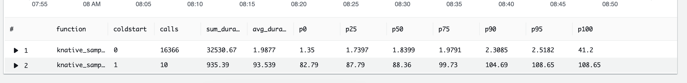

# Kotlin Native Runtime for AWS Lambda

[](https://maven-badges.herokuapp.com/maven-central/io.github.trueangle/lambda-runtime/badge.svg)

A runtime for executing AWS Lambda Functions powered by Kotlin Native, designed to mitigate known
cold start issues associated with the JVM platform.

Project structure:

- `lambda-runtime` — is a library that provides a Lambda runtime.
- `lambda-events` — is a library with strongly-typed Lambda event models, such
  as `APIGatewayRequest`, `DynamoDBEvent`, `S3Event`, `KafkaEvent`, `SQSEvent` and so on.

The runtime supports the
following [OS-only runtime machines](https://docs.aws.amazon.com/lambda/latest/dg/lambda-runtimes.html):

- Amazon Linux 2023 (provided.al2023) with x86_64 architecture
- Amazon Linux 2 (provided.al2) with x86_64 architecture

## Performance

Performance benchmarks reveal that Kotlin Native's "Hello World" Lambda function, executed on Amazon
Linux 2023 (x86_64) with 1024MB of memory, ranks among the top 5 fastest cold starts. Its
performance is on par with Python and .NET implementations. For a comparison with other languages (
including Java), visit https://maxday.github.io/lambda-perf/.



## Getting started

To create a simple lambda function, follow the following steps:

1. Create Kotlin multiplatform project
2. Include library dependency into your module-level build.gradle file

```kotlin
//..
kotlin {
    //..
    sourceSets {
        nativeMain.dependencies {
            implementation("io.github.trueangle:lambda-runtime:0.0.2")
            implementation("io.github.trueangle:lambda-events:0.0.2")
        }
    }
    //..
}
//..
```

3. Specify application entry point reference and supported targets

```kotlin
//..
kotlin {
    //..
    listOf(
        macosArm64(),
        macosX64(),
        linuxArm64(),
        linuxX64(),
    ).forEach {
        it.binaries {
            executable {
                entryPoint = "com.github.trueangle.knative.lambda.runtime.sample.main"
            }
        }
    }
    //..
}
//..
```

4. Choose lambda function type.

There are two types of lambda functions:

###Buffered 
Buffered Lambda function collects all the data it needs to return as a response before sending
it back. This is a default behavior of Lambda function. Response payload max size: 6 MB.

```kotlin
class HelloWorldLambdaHandler : LambdaBufferedHandler<APIGatewayV2Request, APIGatewayV2Response> {
    override suspend fun handleRequest(
        input: APIGatewayV2Request,
        context: Context
    ): APIGatewayV2Response {
        return APIGatewayV2Response(
            statusCode = 200,
            body = "Hello world",
            cookies = null,
            headers = null,
            isBase64Encoded = false
        )
    }
}
```

###Streaming
Streaming function, on the other hand, sends back data as soon as it's available, rather than
waiting for all the data to be ready. It processes and returns the response in chunks, piece by
piece, which can be useful when you want to start delivering results right away, especially for
large or ongoing tasks. This allows for faster responses and can handle data as it comes
in. [More details here.](https://docs.aws.amazon.com/lambda/latest/dg/configuration-response-streaming.html).
For example, `SampleStreamingHandler` reads a large json file and streams it by chunks.

```kotlin
class SampleStreamingHandler : LambdaStreamHandler<ByteArray, ByteWriteChannel> {
    override suspend fun handleRequest(
        input: ByteArray,
        output: ByteWriteChannel,
        context: Context
    ) {
        ByteReadChannel(SystemFileSystem.source(Path("hello.json")).buffered()).copyTo(output)
    }
}
```

5. Specify application entry point using standard `main` function. Call `LambdaRuntime.run` to
   execute Lambda
   by passing handler to it.

```kotlin
fun main() = LambdaRuntime.run { HelloWorldLambdaHandler() }
```

Or for SampleStreamingHandler

```kotlin
fun main() = LambdaRuntime.run { SampleStreamingHandler() }

```

For more examples refer to project's sample.

## Testing Runtime locally

To run runtime
locally [aws runtime emulator](https://github.com/aws/aws-lambda-runtime-interface-emulator) is
used. Here's how to run project's sample:

1. `./gradlew build` to build lambda executable
2. Modify runtime-emulator/Dockerfile to set proper path to the generated executable (.kexe) file,
   located in build/bin/linuxX64/releaseExecutable
3. Run `docker build -t sample:latest .`
4. Start server `docker run -p 9000:8080 sample:latest`
5. Execute function
   via `curl -XPOST "http://localhost:9000/2015-03-31/functions/function/invocations" -d '{}'`

## Build and deploy to AWS

1. Execute `./gradlew build`
2. After successful build execute `cd YOUR_MODULE/build/bin/linuxX64/releaseExecutable/` this will
   locate Lambda handler's executable file, e.g. `YOUR_MODULE.kexe`. The name of the file (including
   the extension) will be used as `handler` name. Don't forget to specify it upon
   lambda-function creation.
3.
Execute `(echo '#!/bin/sh' > bootstrap && echo './"$_HANDLER"' >> bootstrap && chmod +x bootstrap && zip -r bootstrap.zip ./*)`
4. Deploy bootstrap.zip archive to AWS. If you have never used AWS Lambda
   before, [learn how to deploy Lambda function as zip archive manually](https://docs.aws.amazon.com/lambda/latest/dg/configuration-function-zip.html)
   or
   using [AWS CLI](https://docs.aws.amazon.com/codedeploy/latest/userguide/getting-started-codedeploy.html):

```bash
$ aws lambda create-function --function-name sample \
  --handler sample.kexe \ # Important to specify the name of the Lambda\'s executable
  --zip-file bootstrap.zip \
  --runtime provided.al2023 \ # Change this to provided.al2 if you would like to use Amazon Linux 2
  --role arn:aws:iam::XXXXXXXXXXXXX:role/your_lambda_execution_role \
  --environment Variables={RUST_BACKTRACE=1} \
  --tracing-config Mode=Active
```

You can now test the function using the AWS CLI or the AWS Lambda console

```bash
$ aws lambda invoke
--cli-binary-format raw-in-base64-out \
--function-name sample \
--payload '{"command": "Say Hi!"}' \
output.json
$ cat output.json 
```

## Logging

The Runtime uses AWS logging conventions for enhanced log capture, supporting String and JSON log
output
format. It also allows you to dynamically control log levels without altering your code, simplifying
the debugging process. Additionally, you can direct logs to specific Amazon CloudWatch log groups,
making log management and aggregation more efficient at scale. More details on how to set log format
and level refer to the article.
https://aws.amazon.com/blogs/compute/introducing-advanced-logging-controls-for-aws-lambda-functions/

To log lambda function code, use the global Log object with extension functions. The log message
accepts any object / primitive type.

```
Log.trace(message: T?) // The most fine-grained information used to trace the path of your code's execution

Log.debug(message: T?) // Detailed information for system debugging

Log.info(message: T?) // Messages that record the normal operation of your function

Log.warn(message: T?) // Messages about potential errors that may lead to unexpected behavior if unaddressed

Log.error(message: T?) // Messages about problems that prevent the code from performing as expected

Log.fatal(message: T?) // Messages about serious errors that cause the application to stop functioning
```

## Troubleshoot

- If you're going to use Amazon Linux 2023 machine, you'll need to create
  a [lambda layer](https://docs.aws.amazon.com/lambda/latest/dg/chapter-layers.html) with
  libcrypt.so dependency. This is a dynamic library and seems not included into Amazon Linux 2023
  container. The lybcrypt.so can be taken directly from your linux machine (e.g. from
  /lib/x86_64-linux-gnu/libcrypt.so.1 ) or via the
  following [Github Action workflow](https://github.com/trueangle/kotlin-native-aws-lambda-runtime/actions/workflows/libcrypt.yml).
  Once retrieved, zip it and upload as a layer to your lambda function.

- For the time being, only x86-64 architecture is supported by the runtime. LinuxArm64 is not
  supported by Kotlin Native still, details:
    1. The list of supported targets for Kotlin Native (
       2.0.20-RC2) https://repo.maven.apache.org/maven2/org/jetbrains/kotlin/kotlin-native-prebuilt/2.0.20-RC2/
    2. Opened
       issue: https://youtrack.jetbrains.com/issue/KT-36871/Support-Aarch64-Linux-as-a-host-for-the-Kotlin-Native
- If you are running the project build on MacOs you might come across a set of errors connected with
  curl linking e.g. `ld.lld: error: undefined symbol: curl_global_init`. This means that your local
  machine [uses different curl version from what is requested by the runtime](https://youtrack.jetbrains.com/issue/KTOR-6361/Curl-Error-linking-curl-in-linkDebugExecutableLinuxX64-on-macOS).
  To solve that either
  use [Gihub Actions workflow](https://github.com/trueangle/kotlin-native-aws-lambda-runtime/actions/workflows/buildLinux86_64.yml)
  or local docker container with ubuntu 22 under the hood. Example [Dockerfile](Dockerfile) and
  build command:

```bash

docker build -t sample .
docker run --rm -v $(pwd):/sample -w /sample sample ./gradlew build
```