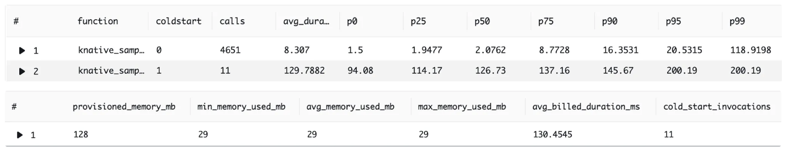
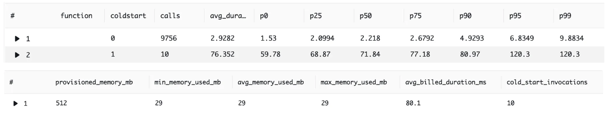

# Kotlin Native Runtime for AWS Lambda
[](https://maven-badges.herokuapp.com/maven-central/io.github.trueangle/lambda-runtime/badge.svg)

A runtime for executing AWS Lambda Functions written in Kotlin/Native, designed to reduce cold start issues common with the JVM platform.

## Project Structure

- `lambda-runtime`: Library providing the Lambda runtime.
- `lambda-events`: Library with strongly-typed Lambda event models like `APIGatewayRequest`, `DynamoDBEvent`, `S3Event`, `KafkaEvent`, `SQSEvent`, etc.
- `sample`: Sample project demonstrating examples of lambda functions.

## Supported [OS-only runtime machines](https://docs.aws.amazon.com/lambda/latest/dg/lambda-runtimes.html)

- Amazon Linux 2023 (provided.al2023) with x86_64 architecture
- Amazon Linux 2 (provided.al2) with x86_64 architecture

## Performance

Benchmarks show that Kotlin Native's "Hello World" Lambda function on Amazon Linux 2023 (x86_64) with 1024MB memory is among the top 5 fastest cold starts, comparable to Python and .NET. For more details, visit [lambda-perf](https://maxday.github.io/lambda-perf/).
- Lambda 128mb provisioned memory

- Lambda 256mb provisioned memory

- Lambda 512mb provisioned memory

- Lambda 1024mb provisioned memory


## Getting started

### 1. Create a Kotlin Multiplatform Project
See [Get started with Kotlin/Native](https://kotlinlang.org/docs/native-get-started.html) for more details.

### 2. Add Dependencies

Add the following to your `build.gradle` file:
```kotlin
plugins {
    id("io.github.trueangle.plugin.lambda") version "0.0.1"
}

kotlin {
    sourceSets {
        nativeMain.dependencies {
            implementation("io.github.trueangle:lambda-runtime:0.0.2")
            implementation("io.github.trueangle:lambda-events:0.0.2")
        }
    }
}
```

### 3. Specify Entry Point and Targets
```kotlin
kotlin {
    listOf(
        macosArm64(),
        macosX64(),
        linuxX64(),
    ).forEach {
        it.binaries {
            executable {
                entryPoint = "com.github.trueangle.knative.lambda.runtime.sample.main" // Link this to your main function entry point
                freeCompilerArgs += listOf("-Xallocator=std")
            }
        }
    }
}
```

### 4. Choose Lambda Function Type

#### Buffered 
Buffered Lambda functions collect all data before sending a response. This is a default behavior of Lambda function. Response payload max size: 6 MB.

```kotlin
class HelloWorldLambdaHandler : LambdaBufferedHandler<APIGatewayV2Request, APIGatewayV2Response> {
    override suspend fun handleRequest(
        input: APIGatewayV2Request,
        context: Context
    ): APIGatewayV2Response {
        return APIGatewayV2Response(
            statusCode = 200,
            body = "Hello world",
            cookies = null,
            headers = null,
            isBase64Encoded = false
        )
    }
}
```
`LambdaBufferedHandler<I, O>` is designed to work with any Kotlin class that is supported by the Kotlin serialization library as both the input and output types. This allows you to define your own custom request and response models annotated with `@Serializable` or utilize existing ones provided by the `lambda-events` module.

#### Streaming
A streaming function sends data as soon as it's available, instead of waiting for all the data. It processes and returns the response in chunks, which is useful for large or ongoing tasks. This allows for faster responses and can handle data as it comes in. [More details here](https://docs.aws.amazon.com/lambda/latest/dg/configuration-response-streaming.html). For example, `SampleStreamingHandler` reads a large json file and streams it in chunks.

```kotlin
class SampleStreamingHandler : LambdaStreamHandler<ByteArray, ByteWriteChannel> {
    override suspend fun handleRequest(
        input: ByteArray,
        output: ByteWriteChannel,
        context: Context
    ) {
        ByteReadChannel(SystemFileSystem.source(Path("hello.json")).buffered()).copyTo(output)
    }
}
```
`LambdaStreamHandler<I, ByteWriteChannel>` accepts any serializable input and outputs to `ByteWriteChannel` which is then streamed to the client.

Both `LambdaBufferedHandler` and `LambdaStreamHandler` are suspend functions, so you can use Kotlin coroutines to handle the request in non-blocking way.

Each handler accepts [`Context`](https://github.com/trueangle/kotlin-native-aws-lambda-runtime/blob/68025bacc26ca075d8d0e9419c45b855a8b4003b/lambda-runtime/src/commonMain/kotlin/io/github/trueangle/knative/lambda/runtime/api/Context.kt#L1) object which can be used to get information about the function execution environment, such as the request ID, resource limits, and other details.

### 5. Specify Main Function
Create application entry point using standard `main` function. Call `LambdaRuntime.run` to execute Lambda by passing handler to it.

```kotlin
fun main() = LambdaRuntime.run { HelloWorldLambdaHandler() }
```

Or for SampleStreamingHandler

```kotlin
fun main() = LambdaRuntime.run { SampleStreamingHandler() }

```

For more examples refer to project's sample.

## Testing Runtime locally

Use the [AWS runtime emulator](https://github.com/aws/aws-lambda-runtime-interface-emulator) to run the runtime locally.

1. `./gradlew build` to build the Lambda executable.
2. Modify `runtime-emulator/Dockerfile` to set the path to the generated executable (.kexe) file in `build/bin/linuxX64/releaseExecutable`.
3. Run `docker build -t sample:latest .`
4. Start server `docker run -p 9000:8080 sample:latest`
5. Execute the function
   using `curl -XPOST "http://localhost:9000/2015-03-31/functions/function/invocations" -d '{}'`

## Build and deploy to AWS

1. Make sure you have applied the plugin `id("io.github.trueangle.plugin.lambda") version "0.0.1"`
2. Execute `./gradlew buildLambdaRelease`. The command will output the path to the archive containing lambda executable (YOUR_MODULE_NAME.kexe) located in (YOUR_MODULE_NAME/build/bin/lambda/release/YOUR_MODULE_NAME.zip)
3. Deploy .zip archive to AWS. If you have never used AWS Lambda
   before, [learn how to deploy Lambda function as zip archive manually](https://docs.aws.amazon.com/lambda/latest/dg/configuration-function-zip.html)
   or
   using [AWS CLI](https://docs.aws.amazon.com/codedeploy/latest/userguide/getting-started-codedeploy.html):

```bash
$ aws lambda create-function --function-name LAMBDA_FUNCTION_NAME \
  --handler YOUR_MODULE_NAME.kexe \ # Important to specify the name of the Lambda executable. 
  --zip-file YOUR_MODULE_NAME.zip \
  --runtime provided.al2023 \ # Change this to provided.al2 if you would like to use Amazon Linux 2
  --role arn:aws:iam::XXXXXXXXXXXXX:role/YOUR_LAMBDA_EXECUTION_ROLE \
  --tracing-config Mode=Active
```

Test the function using the AWS CLI:

```bash
$ aws lambda invoke
--cli-binary-format raw-in-base64-out \
--function-name LAMBDA_FUNCTION_NAME \
--payload '{"command": "Say Hi!"}' \
output.json
$ cat output.json 
```

## Logging

The Runtime uses AWS logging conventions for enhanced log capture, supporting String and JSON log
output
format. It also allows to dynamically control log levels without altering your code, simplifying
the debugging process. Additionally, you can direct logs to specific Amazon CloudWatch log groups,
making log management and aggregation more efficient at scale. More details on how to set log format
and level refer to the article.
https://aws.amazon.com/blogs/compute/introducing-advanced-logging-controls-for-aws-lambda-functions/

Use the global Log object with extension functions. The log message accepts any object / primitive type.

```kotlin
Log.trace(message: T?) // The most fine-grained information used to trace the path of your code's execution

Log.debug(message: T?) // Detailed information for system debugging

Log.info(message: T?) // Messages that record the normal operation of your function

Log.warn(message: T?) // Messages about potential errors that may lead to unexpected behavior if unaddressed

Log.error(message: T?) // Messages about problems that prevent the code from performing as expected

Log.fatal(message: T?) // Messages about serious errors that cause the application to stop functioning
```

## Troubleshooting

- For Amazon Linux 2023, create a [Lambda layer](https://docs.aws.amazon.com/lambda/latest/dg/chapter-layers.html) with the libcrypt.so dependency. This library can be taken from your Linux machine or via the [Github Action workflow](https://github.com/trueangle/kotlin-native-aws-lambda-runtime/actions/workflows/libcrypt.yml).
- Currently, only x86-64 architecture is supported by the runtime. LinuxArm64 is not supported by Kotlin Native yet, For more details, see:
    1. The list of supported targets for Kotlin Native (
       2.0.20-RC2) https://repo.maven.apache.org/maven2/org/jetbrains/kotlin/kotlin-native-prebuilt/2.0.20-RC2/
    2. https://youtrack.jetbrains.com/issue/KT-36871/Support-Aarch64-Linux-as-a-host-for-the-Kotlin-Native
- If you are running the project build on MacOS you might come across a set of errors connected with
  curl linking e.g. `ld.lld: error: undefined symbol: curl_global_init`. This means that your local
  machine [uses different curl version from what is requested by the runtime](https://youtrack.jetbrains.com/issue/KTOR-6361/Curl-Error-linking-curl-in-linkDebugExecutableLinuxX64-on-macOS).
  To solve that either
  use [Gihub Actions workflow](https://github.com/trueangle/kotlin-native-aws-lambda-runtime/actions/workflows/buildLinux86_64.yml)
  or local docker container with ubuntu 22 under the hood. Example [Dockerfile](Dockerfile) and
  build command:

```bash
docker build -t sample .
docker run --rm -v $(pwd):/sample -w /sample sample ./gradlew build
```
